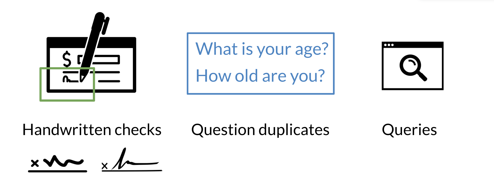
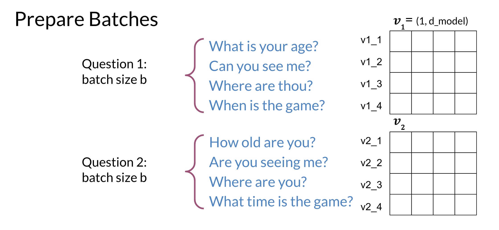

# Siamese-Network-NLP-QuestionSimilarity

## What I Learned and Built

This project is about exploring how two questions can be compared to determine if they have similar meaning. I built a Siamese neural network, a fascinating type of neural architecture where two identical networks share weights to compare the embeddings of two input strings. It taught me a lot about Natural Language Processing (NLP), particularly how semantic similarity works in practice.

The goal was to train a model to detect duplicate questions from a dataset. I learned about the complexities of pre-processing text data, dealing with missing values, and understanding the challenges of working with ambiguous language. The dataset I used contained pairs of questions, along with labels indicating whether the questions were duplicates. I realized that NLP tasks like this involve a lot of careful text cleaning, tokenization, and representation to turn raw text into something a neural network can understand.

Building the Siamese network involved setting up two identical neural networks that use shared weights to process the two questions. These twin networks encode the questions into fixed-length vectors, and the similarity between these vectors can then be measured, usually with a simple distance metric like cosine similarity or a learned distance layer. This architectural approach was particularly insightful because it was very different from traditional supervised learning models, and I learned how weight sharing and twin architecture could help with problems where the relationship between two inputs matters.

The model was trained using TensorFlow and Keras, which gave me hands-on experience with defining custom loss functions such as contrastive loss. This experience taught me a lot about model training, debugging loss function issues, and monitoring the model's performance on both training and validation data. I experimented with different hyperparameters, learning rates, and optimizers, which gave me a good understanding of how to tune a model effectively for better accuracy.

## How Useful It Is

The Siamese network I built can be applied beyond just comparing questions—it's a great tool for any problem involving text similarity, like detecting plagiarism, matching customer queries, or finding related content in large databases. This type of problem is common in search engines, recommendation systems, and customer support systems where understanding the user's intent and finding similar content can greatly enhance user experience.

This experience helped me understand the utility of deep learning in matching concepts, even when expressed with different wordings. The model is particularly useful when you need a system that can go beyond word-matching and instead understand semantic relationships between inputs. For example, in customer support, it can be used to match a user query to a set of possible FAQs, even if the query is phrased differently from the FAQs. The potential applications are vast, from detecting duplicate posts on social media platforms to creating efficient search algorithms that understand user queries contextually.

## Key Insights

Data Processing: Handling large amounts of noisy text data, which is common in real-world scenarios. I learned how to clean, tokenize, and prepare textual data to be fed into deep learning models. Text data can be inherently messy, containing typos, missing values, and inconsistencies, which makes pre-processing a crucial step.

Model Architecture: Understanding how Siamese networks work and their effectiveness for similarity detection. Weight sharing is a unique concept that allows both inputs to be processed in an identical manner, ensuring that the network treats both questions with the same parameters, leading to better generalization when comparing pairs.

Loss Function Design: I explored contrastive loss, which is commonly used for similarity tasks. This loss function helps the network learn by minimizing the distance between similar pairs and maximizing the distance between dissimilar pairs.

Practical Application: The potential uses of text similarity go well beyond this project, into areas like recommendation systems, information retrieval, and even medical data where matching symptoms to possible diagnoses could be valuable. The generalizability of Siamese networks to different domains was one of the most valuable lessons.
